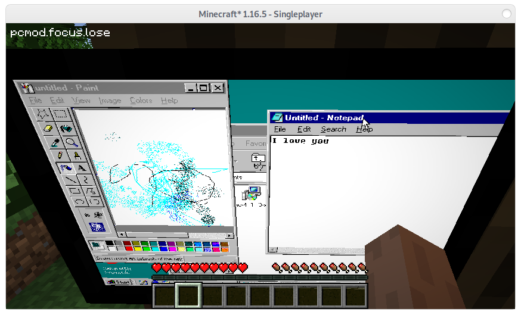

# Fabric PC Mod. Run Any OS inside Minecraft!

**Warning:** currently in alpha.

This mod allows you to run any machine using VNC.

## How to run

Currently, in it's alpha status this is the only way to run it right now:

 - Host a VNC server of your choice (i.e Windows 98 in a VM) and open it at port 5900 without a password
 - Get yourself a screen (you could use `/give <username> pcmod:flatscreen`)
 - Right click to place it, and then right click on it again to open the screen and interact with it.

## Special thanks

Huge shoutout to the devs at [MCVmComputers](https://github.com/Delta2Force/MCVmComputers) for making their mod. My mod reused a lot of their code to make this work.